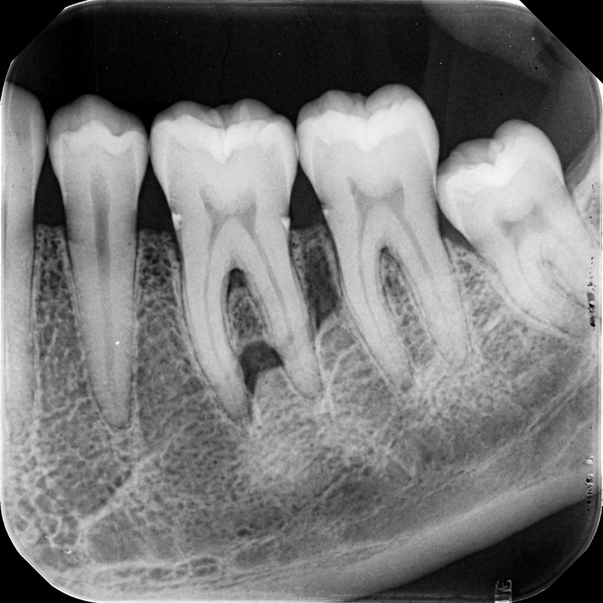
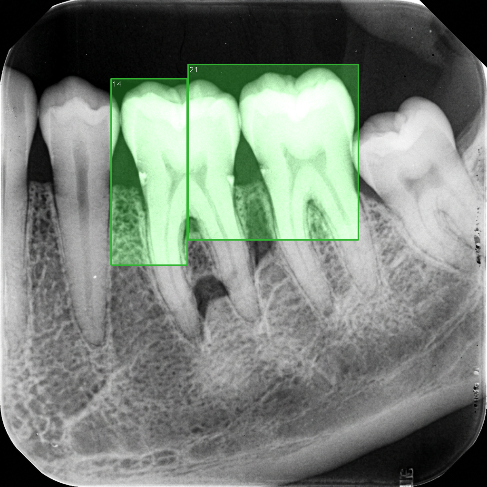

# 🦷 Dental AI System v1.0

An advanced Artificial Intelligence system for automatic analysis of panoramic dental radiographs. The system performs tooth segmentation, ROI extraction, disease detection, and structured report generation with minimal user interaction.

---

# 📸 Overview



Dental AI System follows a two-stage pipeline:

1. **Tooth Segmentation**
2. **Automated Disease Diagnosis**

The system processes panoramic dental X-rays and generates visual results, cropped tooth images, and machine-readable diagnostic reports.

---

# ✨ Key Features

* Automatic panoramic dental X-ray analysis.
* AI-powered tooth segmentation.
* Individual tooth ROI extraction.
* Multi-disease detection.
* JSON report generation.
* Visual diagnostic outputs.
* Simple one-click execution.
* Batch image processing support.
* Research and educational friendly architecture.

---

# 🔬 Supported Diagnoses

| Condition         | Description                          |
| ----------------- | ------------------------------------ |
| Early Caries      | Early-stage tooth decay              |
| Deep Caries       | Advanced tooth decay                 |
| Periapical Lesion | Lesions around the tooth root apex   |
| Impacted Tooth    | Unerupted or partially erupted tooth |

---

# ⚙️ How It Works

## Step 1 — Input Radiograph

Place panoramic dental radiographs inside:

```text
radiographs/
```

### Example Input


---

## Step 2 — Tooth Segmentation

The segmentation model identifies and separates teeth from the panoramic image.

### Segmentation Result


---

## Step 3 — ROI Extraction

Each detected tooth is automatically cropped into a separate Region of Interest (ROI).

### ROI Samples


---

## Step 4 — Disease Detection

The diagnostic model analyzes each extracted tooth and predicts the presence of supported dental conditions.

### Diagnostic Output


---

## Step 5 — Report Generation

A structured JSON report is generated containing:

* Tooth ID
* Diagnosis
* Confidence Score
* Bounding Box Coordinates

### Example Report

```json
{
  "tooth_id": 16,
  "diagnosis": "Deep Caries",
  "confidence": 0.94
}
```

---

# 🚀 Quick Start

## 1. Add Radiographs

Copy panoramic dental X-ray images into:

```text
radiographs/
```

---

## 2. Run the System

Double-click:

```text
SETUP_AND_RUN.bat
```

The script will automatically:

* Install dependencies
* Verify pretrained models
* Launch the analysis pipeline
* Save all outputs

---

## 3. View Results

Generated results will be available inside:

```text
outputs/
```

---

# 📂 Project Structure

```text
dental_ai_system/
│
├── radiographs/
│
├── outputs/
│   ├── segmentations/
│   ├── diagnoses/
│   ├── roi_crops/
│   └── reports/
│
├── configs/
│
├── pretrained_models/
│
├── docs/
│   └── images/
│
├── SETUP_AND_RUN.bat
├── RUN_SINGLE_IMAGE.bat
└── OPEN_RESULTS.bat
```

---

# 📁 Output Examples

## Tooth Segmentation


## Disease Detection


## Generated Report


---

# 🖥️ Available Scripts

| Script               | Description                     |
| -------------------- | ------------------------------- |
| SETUP_AND_RUN.bat    | Full installation and execution |
| RUN_SINGLE_IMAGE.bat | Analyze a single radiograph     |
| OPEN_RESULTS.bat     | Open output directories         |

---

# 📊 Complete Workflow



```text
Panoramic Dental X-Ray
          │
          ▼
 Tooth Segmentation
          │
          ▼
 ROI Extraction
          │
          ▼
 Disease Detection
          │
          ▼
 Report Generation
          │
          ▼
 Final Outputs
```

---

# 🎯 Applications

* Dental Clinics
* Hospitals
* Universities and Medical Schools
* AI Research Projects
* Dental Imaging Studies
* Educational Demonstrations

---

# 📄 License

This project is intended for research and educational purposes. Any clinical use should be validated and supervised by qualified dental professionals.
