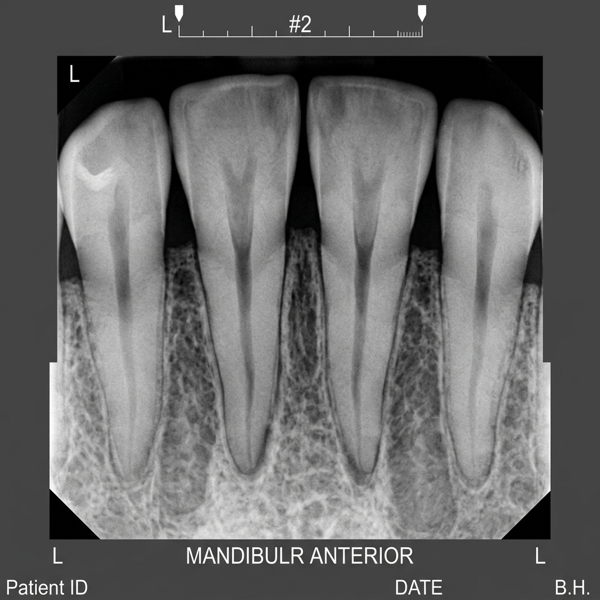
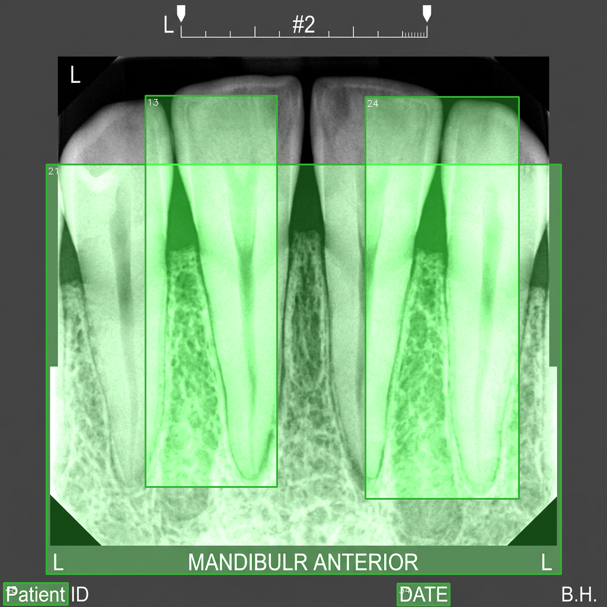

# 🦷 Dental AI System v1.0

An advanced Artificial Intelligence system for automatic analysis of panoramic dental radiographs. The system performs tooth segmentation, ROI extraction, disease detection, and structured report generation with minimal user interaction.

<p align="center">
  
</p>

<p align="center">
  <b>Automatic Tooth Segmentation • ROI Extraction • Disease Detection • JSON Reporting</b>
</p>

---

## 📖 Overview

Dental AI System is an AI-powered framework designed to analyze panoramic dental X-ray images automatically.

The system follows a two-stage pipeline:

1. **Tooth Segmentation**
2. **Automated Disease Diagnosis**

The generated outputs include:

* Segmented teeth
* Cropped tooth regions (ROI)
* Disease predictions
* Diagnostic visualizations
* Structured JSON reports

---

## ✨ Features

* Automated panoramic dental X-ray analysis
* AI-based tooth segmentation
* Individual tooth ROI extraction
* Multi-condition diagnosis
* Structured JSON reporting
* Visual result generation
* One-click execution
* Batch image processing
* Research and educational use

---

## 🔬 Supported Diagnoses

| Condition         | Description                          |
| ----------------- | ------------------------------------ |
| Early Caries      | Early-stage tooth decay              |
| Deep Caries       | Advanced tooth decay                 |
| Periapical Lesion | Lesions around the root apex         |
| Impacted Tooth    | Unerupted or partially erupted tooth |

---

## ⚙️ Processing Pipeline

```text
Input Panoramic X-Ray
          │
          ▼
 Tooth Segmentation
          │
          ▼
 ROI Extraction
          │
          ▼
 Disease Detection
          │
          ▼
 Report Generation
          │
          ▼
 Final Results
```

---

## 🚀 Quick Start

### 1. Place X-Ray Images

Copy panoramic radiographs into:

```text
radiographs/
```

### 2. Run the System

Double-click:

```text
SETUP_AND_RUN.bat
```

The launcher automatically:

* Installs dependencies
* Verifies pretrained models
* Executes the complete pipeline
* Saves generated outputs

### 3. View Results

Results are stored inside:

```text
outputs/
```

---

## 📂 Project Structure

```text
Dental-AI-System/
│
├── README.md
├── IMG_20260424_055547_415.png
│
├── radiographs/
│
├── outputs/
│   ├── segmentations/
│   ├── diagnoses/
│   ├── roi_crops/
│   └── reports/
│
├── configs/
├── pretrained_models/
├── requirements.txt
│
├── SETUP_AND_RUN.bat
├── RUN_SINGLE_IMAGE.bat
└── OPEN_RESULTS.bat
```

---

## 📊 Example Output

<p align="center">
  
</p>

The generated output includes:

* Tooth localization
* Segmentation masks
* Disease classification
* Confidence scores
* Diagnostic reports

---

## 🖥️ Available Scripts

| Script               | Description                     |
| -------------------- | ------------------------------- |
| SETUP_AND_RUN.bat    | Full installation and execution |
| RUN_SINGLE_IMAGE.bat | Analyze a single radiograph     |
| OPEN_RESULTS.bat     | Open output directories         |

---

## 📦 Installation

```bash
pip install -r requirements.txt
```

---

## 🎯 Applications

* Dental Clinics
* Hospitals
* Universities
* Medical Research
* AI Research Projects
* Dental Imaging Studies

---

## 📄 License

This project is intended for research and educational purposes only.

Clinical use should be validated and supervised by qualified dental professionals.
